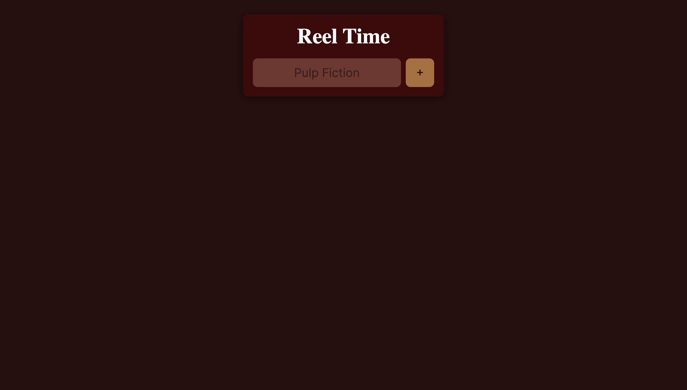

# Reel Time is a simple add that store movie names in Firebase Database and list movie name on screen

Reel Time is a simple web application that allows users to add their favorite movie titles to a Firebase Realtime Database. The application provides an intuitive interface to input movie names and store them for later reference.

## Features

- Add movie titles to the database
- User-friendly interface
- Responsive design

## Visual Design

Below is a visual representation of the website page:



## Getting Started

To get a local copy up and running, follow these simple steps.

### Prerequisites

- A modern web browser (e.g., Chrome, Firefox)
- An internet connection (for Firebase)

### Installation

1. Clone the repository:

```bash
git clone https://github.com/BhoomiGohil/Scrimba-JS-AddAndListMovies.git
```

2. **Navigate to the project directory:**

```bash
cd Scrimba-JS-AddAndListMovies
```

3. **Open the `index.html` file in your web browser.**

```bash
open index.html
```

OR

3. **Open the project using Live Server:**

If you're using Visual Studio Code, install the Live Server extension.
Click on the "Go Live" option to run the project.

**Note:** This project requires a Firebase Database to store and retrieve data. Please set up a Firebase project and update the `databaseURL` in the JavaScript code accordingly.

## Usage

1. Type the name of the movie you want to add in the input field.
2. Click the "+" button to add the movie to the database.
3. (If implemented) View your added movies below the input field.

## Technologies Used

- HTML
- CSS
- JavaScript
- Firebase Realtime Database

## Resources

Feel free to explore the code. Happy coding!
